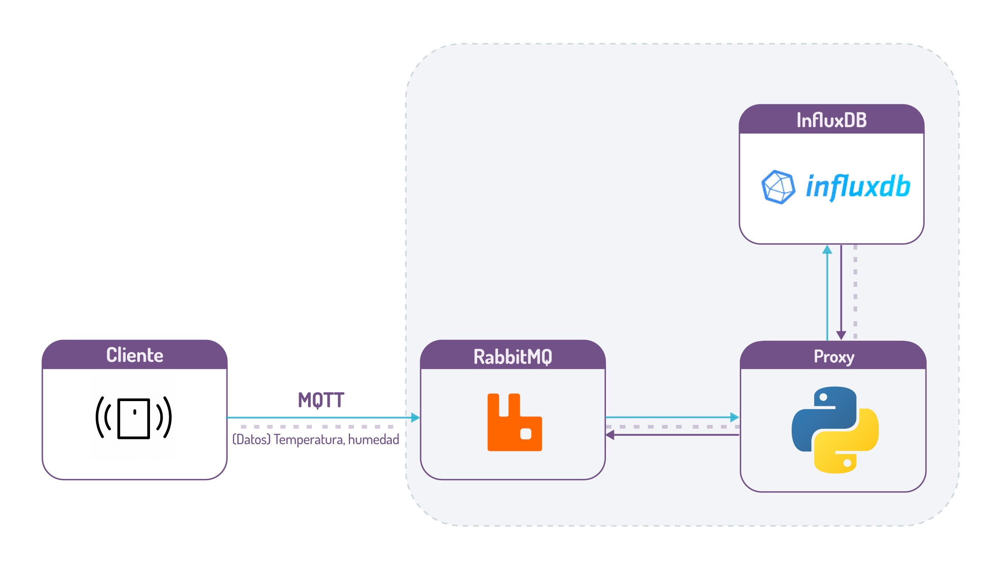

# Servidor.
Demo, Taller de Servicios

## Uso, en bash

## 1. llenar las credenciales
 llenar el archivo credentials.env
 
### 2. Construir.
```bash
docker-compose build
```

### 3. Ejecutar.
```bash
docker-compose up -d
```

### 4. Detener.
```bash
docker-compose down
```
